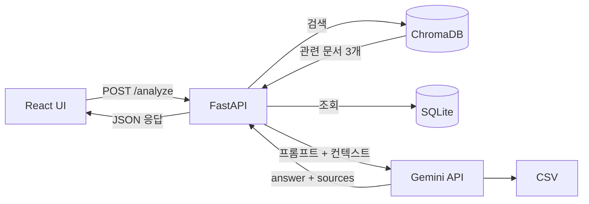

# CareerFit AI

> 취업·공모전 데이터 기반 맞춤형 AI 포트폴리오 코치

<br>

## 📌 프로젝트 개요

### 문제 정의
취업 준비생은 채용 공고에서 요구하는 역량을 파악하고 자신의 역량과 비교하는 데 많은 시간이 소요된다. 또한 단순 AI 답변은 실제 채용 공고를 근거로 하지 않아 신뢰성이 떨어질 수 있다.

### 해결 방법 
CareerFit AI는 RAG(Retrieval-Augmented Generation) 구조를 활용하여 채용 공고 데이터를 검색한 뒤, Gemini AI가 이를 기반으로 맞춤형 역량을 분석하는 서비스이다.

<br>


## 🛠 기술 스택

| 영역 | 기술 |
|---|---|
| 백엔드 | Python 3.11, FastAPI |
| AI API | Gemini 2.5 Flash-Lite |
| 데이터 | Pandas, SQLite, ChromaDB |
| 프론트엔드 | React, Vite |
| 실행 환경 | Docker |

<br>

## 🏗 아키텍처




<br>

## 🚀 실행 방법

### Docker로 실행 (권장)

```bash

# 1. 이미지 빌드

docker build -t careerfit-ai ./backend

# 2. 컨테이너 실행

docker run -p 8000:8000 --env-file backend/.env careerfit-ai

```

API 문서: http://localhost:8000/docs

### 로컬 실행

```bash

cd backend

# python -m venv venv

source venv\Scripts\activate # Mac: venv/bin/activate

# pip install -r requirements.txt

uvicorn main:app --reload --port 8000

```


<br>

## 📊 데이터 파이프라인

```

CSV → Pandas 전처리 → SQLite (구조화 저장) → ChromaDB (벡터 검색)

```

전처리 실행:

```bash

# python data/preprocess.py

```
<br>

## ✨ 주요 기능

- RAG 기반 역량 분석: 취업 공고 데이터를 근거로 맞춤형 조언 제공

- 출처 표시: 어떤 공고 데이터를 참고했는지 sources로 함께 반환

- Mock Mode: API 한도 초과 시 MOCK_MODE=true 로 폴백 가능

- Docker 기반 컨테이너 실행 및 Render 배포

<br>

## 📁 프로젝트 구조

```

careerfit_ai/

├── backend/

│   ├── data/

│   ├── routers/

│   ├── services/

│   ├── chroma_db/

│   ├── Dockerfile

│   └── main.py

├── frontend/

│   ├── src/

│   └── package.json

├── docs/

└── README.md
```

<br>

## 🔮 향후 개선

- [ ] 프론트엔드(Render) 배포 및 백엔드와 완전한 클라우드 연동

- [ ] 이력서 PDF 업로드 후 AI 기반 역량 분석 및 맞춤형 직무 추천

<br>

## 📝 개발 과정

[RAG와 Docker 환경을 처음 구축하면서 ChromaDB, FastAPI, React 연동 과정에서 다양한 오류를 경험했다. Docker 컨테이너 실행 오류와 Render 배포 과정의 문제를 해결하며 로컬 개발 환경과 클라우드 배포 환경의 차이를 이해하고 서비스 배포 경험을 쌓았다.]

<br>


## ✅  진행 현황


### ✅ 1일차 : 프로젝트 기획 및 개발 환경 세팅

* CareerFit AI 프로젝트의 폴더 구조와 개발 환경을 구성
* GitHub Repository를 생성하고 버전 관리 및 협업 환경을 구축
* `.env`, `.gitignore` 등을 설정하여 보안 및 환경변수 관리 기반을 마련
* Cursor AI 규칙, 프롬프트, 체크리스트 등 프로젝트 문서를 작성하여 개발 가이드를 정리
* 프로젝트 계획 수립 및 팀 협업 준비를 완료

<br>

### ✅ 2일차 : FastAPI 서버 구축 및 Gemini API 연결

* Python 가상환경을 세팅하고 FastAPI 기반 백엔드 서버 구조를 구축
* `/health`, `/jobs`, `/analyze` 엔드포인트를 구현해 기본 API 흐름을 확인
* Gemini 2.5 Flash-Lite API를 연결해 AI 분석 응답 생성 기능을 준비
* `MOCK_MODE` 환경변수를 설정해 API 한도 초과 상황에서도 테스트 가능하도록 구성
* 2일차 기준 백엔드 핵심 기능과 LLM 연동 실습을 완료

<br>

### ✅ 3일차 : 데이터 파이프라인 구축

* `jobs.csv` 채용 공고 데이터를 기반으로 전처리 파이프라인(`preprocess.py`)을 구현
* Pandas를 활용해 CSV 데이터를 읽고 결측치 확인, 결측치 처리, 중복 제거를 수행
* 스킬 키워드(Python, SQL, Machine Learning 등)를 표준화하여 데이터 일관성을 확보
* 전처리된 데이터를 SQLite 데이터베이스에 저장하고 SQL 조회를 통해 저장 결과를 검증
* AI가 활용하기 위한 데이터 전처리 및 저장 파이프라인 구축 완료

<br>

### ✅ 4일차: RAG 기반 서비스 + React UI

* RAG 검색 결과를 활용하는 AI 응답 파이프라인을 React 프론트엔드와 연동
* `/analyze` API를 통해 사용자 입력(전공, 보유 스킬, 관심 직무)을 분석하고 결과 및 출처를 화면에 출력
* `InputForm`, `ResultCard`, `SourceCard` 컴포넌트를 구현하고 Tailwind CSS 기반 UI 개선
* VS Code - Continue + Gemini AI Studio를 연동하여 AI 개발 환경(Harness) 구축 및 `design-skill.md` 작성
* 프로젝트 구조를 정리하고 프론트엔드와 백엔드 통합 테스트 완료

<br>

### ✅ 5일차: Docker + 포트폴리오 완성

* Dockerfile과 .dockerignore를 작성하여 FastAPI 서비스를 컨테이너 환경에서 실행
* Docker Image 생성 및 Container 실행을 통해 로컬 환경과 동일한 실행 환경을 구축
* Render Web Service를 이용하여 Docker 기반 FastAPI 서버를 클라우드에 배포
* 환경변수(.env)를 활용하여 Gemini API Key를 안전하게 관리하고 GitHub 노출을 방지
* Docker와 Render를 활용한 서비스 배포 및 운영 환경 구축 완료


<br>

---

## Demo

- Live Demo: https://careerfit-ai-tdjx.onrender.com

---

## Developer

- Name: Speed_loaf

- Role: Backend / AI Service Development

- GitHub: https://github.com/imnoah-debug
